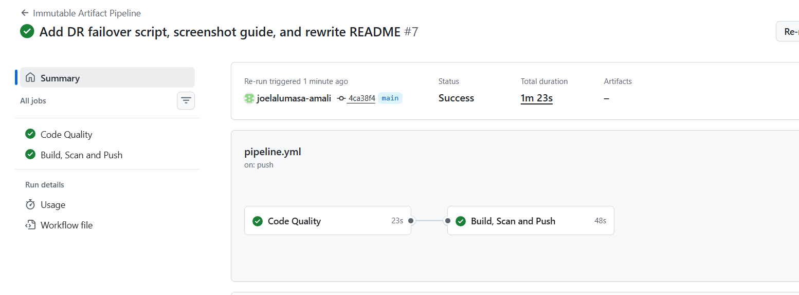
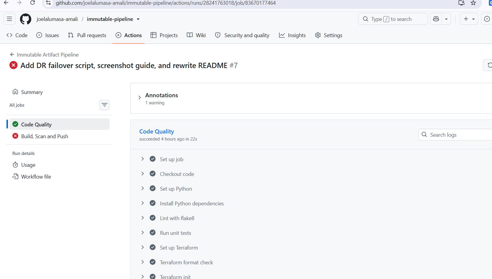
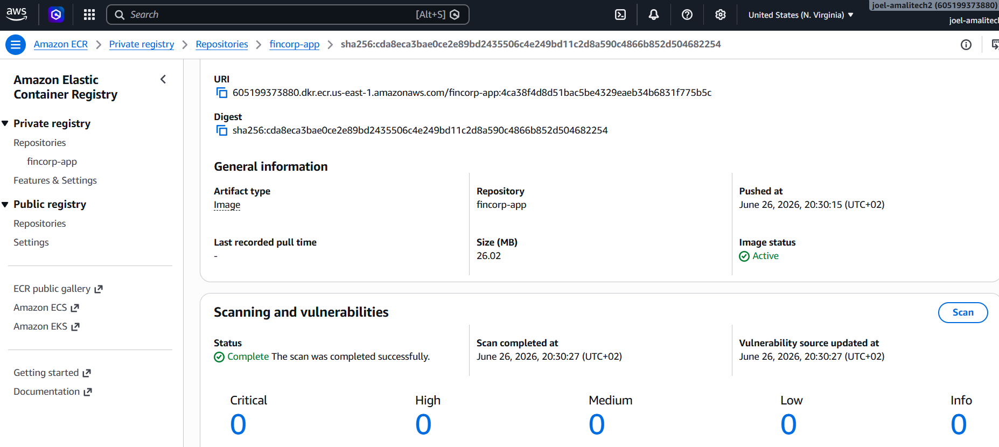
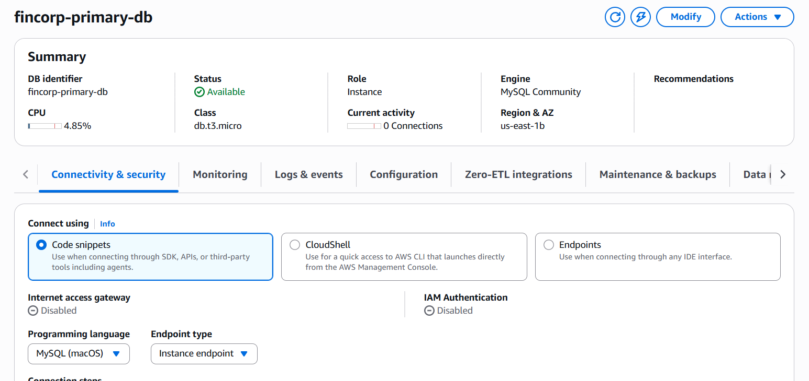
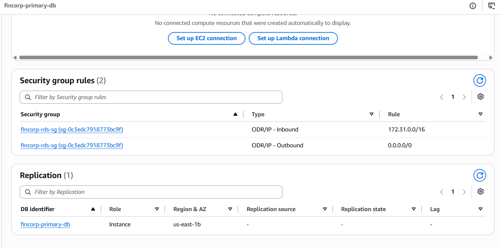
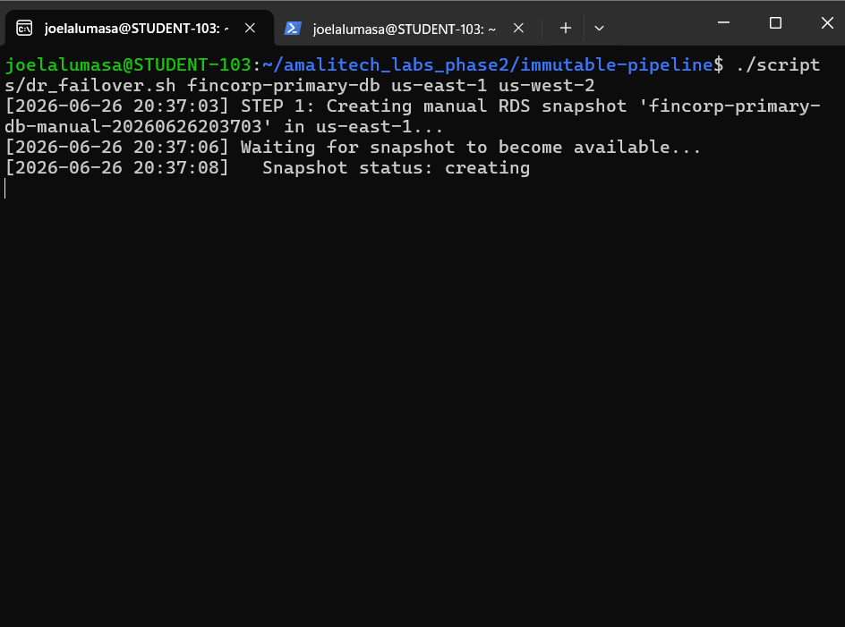
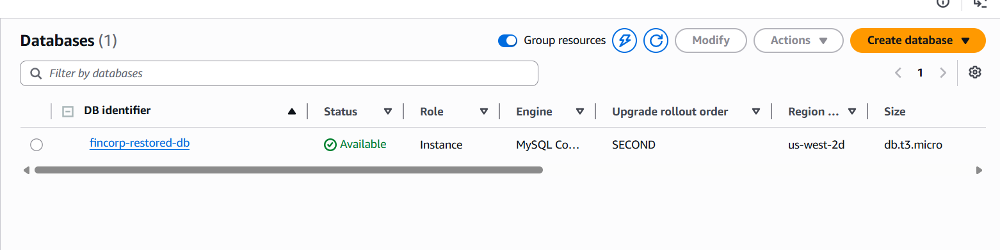
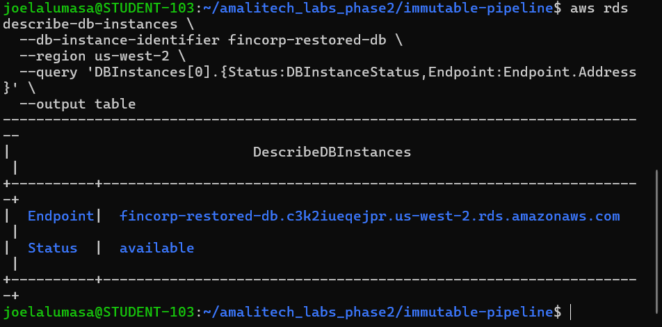

# The Immutable & Indestructible Pipeline

> **FinCorp** — A production-grade secure CI/CD pipeline with immutable artifacts, automated vulnerability scanning, and cross-region disaster recovery (RTO ≤ 30 min).

---

## Architecture

```
Developer
    │
    │  git push → main
    ▼
┌─────────────────────────────────────────────────────────────┐
│                   GitHub Actions Pipeline                    │
│                                                             │
│  ┌──────────────────────────────────────────────────────┐  │
│  │                  code-quality                        │  │
│  │  ✓ flake8 (Python lint)   ✓ pytest (unit tests)     │  │
│  │  ✓ terraform fmt -check   ✓ terraform validate       │  │
│  │  ✓ hadolint (Dockerfile)                             │  │
│  └──────────────────────┬───────────────────────────────┘  │
│                         │  must pass                        │
│  ┌──────────────────────▼───────────────────────────────┐  │
│  │                build-scan-push                       │  │
│  │  docker build → ECR push → vulnerability scan        │  │
│  │  ✗ fails if HIGH or CRITICAL CVEs found              │  │
│  └──────────────────────────────────────────────────────┘  │
└─────────────────────────────────────────────────────────────┘
                          │
         ┌────────────────▼────────────────────────────────────┐
         │          AWS Infrastructure  (us-east-1 / Primary)  │
         │                                                      │
         │  ┌──────────────────┐  ┌────────────────────────┐   │
         │  │  ECR Repository  │  │  CodeArtifact Domain   │   │
         │  │  IMMUTABLE tags  │  │  ┌──────┐ ┌─────────┐  │   │
         │  │  scan on push    │  │  │ npm  │ │   pip   │  │   │
         │  │  lifecycle rules │  │  └──────┘ └─────────┘  │   │
         │  └──────────────────┘  └────────────────────────┘   │
         │                                                      │
         │  ┌───────────────────────────────────────────────┐  │
         │  │  RDS MySQL  db.t3.micro                       │  │
         │  │  ✓ encrypted at rest  ✓ VPC-isolated (3306)   │  │
         │  │  ✓ 7-day retention    ✓ private subnet group  │  │
         │  └──────────────────────┬────────────────────────┘  │
         │                         │ AWS Backup (daily 02:00)   │
         │  ┌──────────────────────▼────────────────────────┐  │
         │  │  Backup Vault (KMS-encrypted)                 │  │
         └──┼───────────────────────────────────────────────┘  │
            │  cross-region copy                                │
            ▼                                                   │
         ┌──────────────────────────────────────────────────┐   │
         │        AWS Infrastructure  (us-west-2 / DR)      │   │
         │  ┌──────────────────────────────────────────┐    │   │
         │  │  DR Backup Vault (KMS-encrypted)         │    │   │
         │  │  Recovery Points → restore as new RDS    │    │   │
         │  └──────────────────────────────────────────┘    │   │
         └──────────────────────────────────────────────────┘   │
```

---

## Infrastructure Components

| Component | Terraform Resource | Region | Key Settings |
|---|---|---|---|
| ECR Repository | `aws_ecr_repository` | us-east-1 | IMMUTABLE tags, scan on push |
| ECR Lifecycle Policy | `aws_ecr_lifecycle_policy` | us-east-1 | Expire untagged after 1 day, keep last 10 tagged |
| CodeArtifact Domain | `aws_codeartifact_domain` | us-east-1 | Account-restricted permissions policy |
| CodeArtifact npm | `aws_codeartifact_repository` | us-east-1 | Upstream: public:npmjs |
| CodeArtifact pip | `aws_codeartifact_repository` | us-east-1 | Upstream: public:pypi |
| RDS MySQL | `aws_db_instance` | us-east-1 | db.t3.micro, encrypted, VPC-only, 7-day backup |
| RDS Subnet Group | `aws_db_subnet_group` | us-east-1 | Default VPC subnets |
| RDS Security Group | `aws_security_group` | us-east-1 | Port 3306 from VPC CIDR only |
| Primary Backup Vault | `aws_backup_vault` | us-east-1 | KMS-encrypted |
| DR Backup Vault | `aws_backup_vault` | us-west-2 | KMS-encrypted |
| KMS Key (Primary) | `aws_kms_key` | us-east-1 | Auto-rotation enabled |
| KMS Key (DR) | `aws_kms_key` | us-west-2 | Auto-rotation enabled |
| Backup Plan | `aws_backup_plan` | us-east-1 | Daily at 02:00 UTC, cross-region copy |
| IAM Backup Role | `aws_iam_role` | us-east-1 | Backup + restore policy attachments |

---

## Lab Objective 1 — Immutable Artifact Pipeline

### Overview

Every commit to `main` triggers a two-stage GitHub Actions pipeline. The `code-quality` gate must pass before Docker images are built and pushed. Images are tagged with the git commit SHA and pushed to ECR with **IMMUTABLE** tag mutability — once pushed, a tag can never be overwritten.

### Supply Chain Control — AWS CodeArtifact

AWS CodeArtifact acts as an authenticated proxy for npm and pip registries. All package installs during builds resolve through CodeArtifact, giving FinCorp full visibility and control over third-party dependencies. A domain-level permissions policy restricts access to the current AWS account only.

### Container Registry — Amazon ECR

- **Tag Immutability:** `ENABLED` — a commit SHA tag cannot be reused or overwritten after push.
- **Scan on Push:** `ENABLED` — every image is automatically scanned for OS and library CVEs.
- **Lifecycle Policy:** Untagged images expire after 1 day; only the last 10 tagged images are retained.

The pipeline fails immediately if any `HIGH` or `CRITICAL` vulnerabilities are found, blocking the deployment.








### CodeArtifact Repositories


---

## Lab Objective 2 — Cross-Region Disaster Recovery

### Overview

The primary RDS MySQL instance in `us-east-1` is backed up daily by AWS Backup. Recovery points are automatically copied to a DR vault in `us-west-2`. In a failure scenario, the DR script restores a new RDS instance from the latest snapshot, achieving RTO well within 30 minutes.

### Backup Architecture

- **Daily backup:** Runs at 02:00 UTC via an AWS Backup plan.
- **Cross-region copy:** Each recovery point is automatically copied to `us-west-2`.
- **KMS encryption:** Both vaults use dedicated KMS keys with automatic key rotation enabled.


### Primary RDS Instance





---

## DR Simulation Procedure

The `scripts/dr_failover.sh` script performs the complete failover procedure with timestamped output at each step.

### Prerequisites

```bash
# AWS CLI configured with credentials that have RDS + Backup access
aws configure

# Verify the primary instance is running
aws rds describe-db-instances \
  --db-instance-identifier fincorp-primary-db \
  --region us-east-1 \
  --query 'DBInstances[0].DBInstanceStatus'
```

### Running the Failover

```bash
# Using positional arguments
bash scripts/dr_failover.sh fincorp-primary-db us-east-1 us-west-2

# Or using environment variables
export INSTANCE_ID=fincorp-primary-db
export SOURCE_REGION=us-east-1
export DR_REGION=us-west-2
bash scripts/dr_failover.sh
```

### Step-by-Step Procedure

| Step | Action | Typical Duration |
|---|---|---|
| 1 | Create manual RDS snapshot in us-east-1 | 3–8 min |
| 2 | Retrieve snapshot ARN | < 1 sec |
| 3 | Copy snapshot to us-west-2 | 5–10 min |
| 4 | Delete primary DB (simulate failure) | 2–5 min |
| 5 | Restore new instance from snapshot in us-west-2 | 5–10 min |
| 6 | Wait for availability and print endpoint | 3–5 min |
| **Total** | | **~18–38 min** |







---

## Security Hardening

### 1. ECR Tag Immutability

Setting `image_tag_mutability = "IMMUTABLE"` prevents any image from being overwritten after push. A build tagged with commit SHA `abc123` is permanent — no one can push a different (potentially malicious) image under the same tag. This is the foundation of a reproducible, auditable artifact pipeline.

### 2. ECR Lifecycle Policy

Registry hygiene reduces attack surface. Untagged "dangling" images (often from failed builds) are deleted after 1 day to prevent them from being accidentally deployed. Only the 10 most recent tagged images are retained, keeping storage costs low and the registry clean.

### 3. RDS Encryption at Rest

`storage_encrypted = true` enables AWS-managed AES-256 encryption for all data, automated backups, snapshots, and read replicas. This satisfies financial data regulatory requirements (PCI-DSS, SOC 2) without any application-layer changes.

### 4. RDS VPC Isolation

The RDS instance is placed in a dedicated subnet group and protected by a security group that allows port 3306 inbound **only from the VPC CIDR** (`172.31.0.0/16`). `publicly_accessible = false` ensures the instance has no public IP. The database is unreachable from the internet.

### 5. KMS-Encrypted Backup Vaults

Both the primary and DR backup vaults are encrypted with dedicated KMS Customer Managed Keys (CMKs). Using separate CMKs per region means DR vault access is independently controlled. Automatic key rotation (`enable_key_rotation = true`) limits the blast radius of any key compromise.

### 6. CodeArtifact Domain Permissions Policy

A resource-based policy on the CodeArtifact domain restricts all `codeartifact:*` actions to the current AWS account's root principal only. This prevents cross-account access and ensures that no external party can push packages into the domain, protecting the software supply chain.

### 7. Pipeline Quality Gates

The `code-quality` job acts as a mandatory pre-build gate:
- **flake8** enforces Python style and catches common errors before they reach production.
- **pytest** validates application logic on every commit.
- **terraform fmt -check** prevents infrastructure drift from inconsistent formatting.
- **terraform validate** catches configuration errors before any `apply`.
- **hadolint** enforces Dockerfile best practices (non-root user, no-cache-dir, pinned base images).

`build-scan-push` has `needs: code-quality`, so a failing quality check completely blocks image publication.

---

## Project Structure

```
immutable-pipeline/
├── .github/
│   └── workflows/
│       ├── pipeline.yml          # CI/CD pipeline definition
│       └── check_scan.py         # ECR scan result checker
├── app/
│   ├── app.py                    # Flask application
│   ├── Dockerfile                # Hardened container image
│   ├── requirements.txt          # Python dependencies
│   └── test_app.py               # pytest unit tests
├── docs/
│   └── screenshots/
│       └── README.md             # Screenshot capture guide
├── infrastructure/
│   └── terraform/
│       ├── main.tf               # Provider configuration
│       ├── variables.tf          # Input variables
│       ├── ecr.tf                # ECR repository + lifecycle policy
│       ├── codeartifact.tf       # CodeArtifact domain + repositories + policy
│       ├── rds.tf                # RDS instance + subnet group + security group
│       └── backup.tf             # KMS keys + backup vaults + plan
├── scripts/
│   └── dr_failover.sh            # Automated DR failover procedure
└── README.md
```

---

## Getting Started

### Prerequisites

- AWS CLI configured with admin credentials
- Terraform >= 1.5
- Docker
- Python 3.11+

### Deploy Infrastructure

```bash
cd infrastructure/terraform
terraform init
terraform plan
terraform apply
```

### Run Tests Locally

```bash
cd app
pip install flask pytest flake8
pytest test_app.py -v
flake8 .
```

### Trigger the Pipeline

```bash
git add .
git commit -m "feat: trigger pipeline run"
git push origin main
```

Monitor the run at: `https://github.com/<your-org>/immutable-pipeline/actions`

### Teardown

```bash
cd infrastructure/terraform
terraform destroy
```
